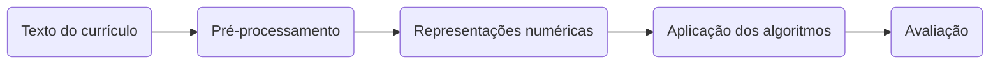

# Classificação Automática de Currículos de Profissionais de TI

Estudo realizado como parte dos requisitos para a obtenção do grau de Mestre em Computação Aplicada pelo Instituto Federal do Espírito Santo. O objetivo desta pesquisa é fazer uma comparação entre diferentes abordagens para a classificação automatizada de currículos de profissionais da área de Tecnologia da Informação e Comunicação (TIC). Essas abordagens variam desde algoritmos tradicionais até modelos avançados baseados em redes neurais profundas, incluindo também o uso de modelos pré-treinados de linguagem. A avaliação dessas abordagens foi realizada em uma base de dados que contém 27.405 currículos, os quais foram categorizados em oito grupos distintos relacionados às áreas de atuação dos profissionais de TIC.

## Fluxo de dados

## Algoritmos avaliados

**Algoritmos Tradicionais:**
- Árvore de Decisão
- CatBoost
- Extra Trees
- Floresta Aleatória
- KNN
- LightGBM
- MLP
- Regressão Logística
- SVM
- XGBoost

**Algoritmos baseados em redes neurais profundas:**
- CNN
- CNN+BiLSTM

**Modelos pré-treinados:**
- ALBERT
- BERT
- DistilBERT
- RoBERTa

## Métricas de Avaliação

- Acurácia
- Precisão
- Cobertura
- Medida-F
